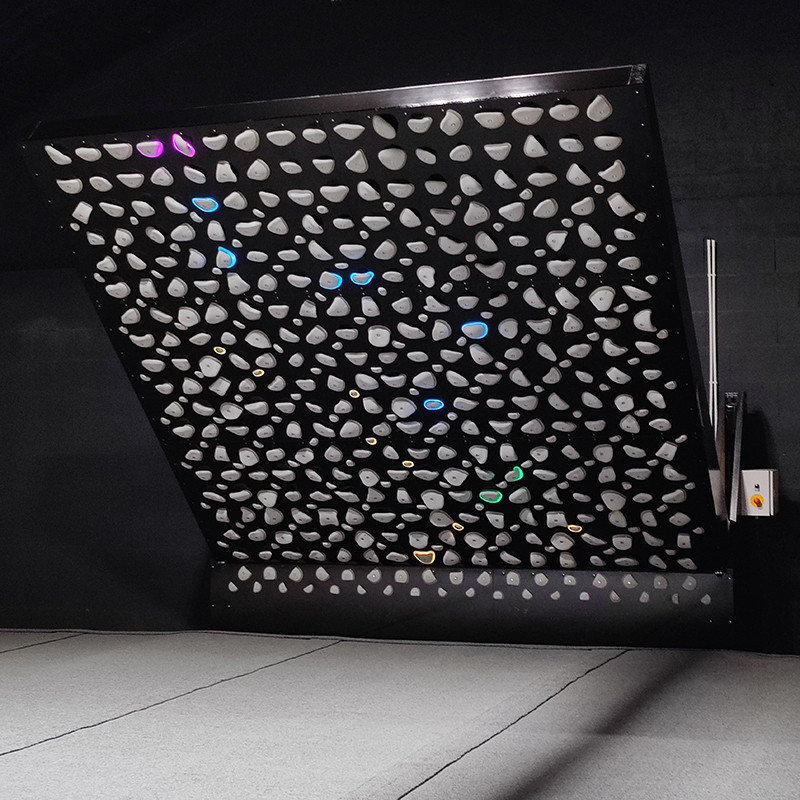
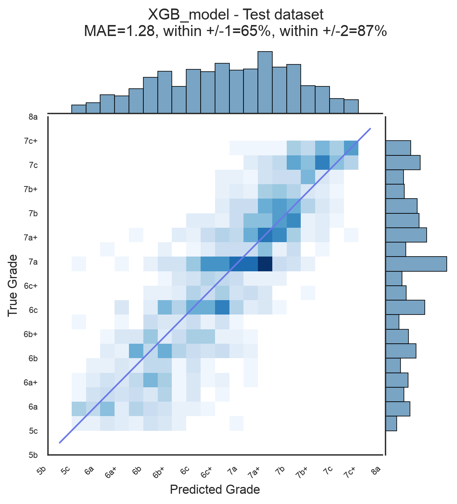

# Kilter Grade Prediction

This project aims to predict the difficulty grade of climbs on the Kilter Board using machine learning, in order to assist route setters in grading climbs consistently and objectively.

---

*16x12 Original Layout – The standard Kilter Board configuration.*

---

## 📌 Overview
The **Kilter Board** is a standardised climbing board: each **climb** ("problem") is defined by the **holds** that may be used, together with the **role** of each hold
(start / hand / foot / finish) and the board **angle**. In this project we leverage data from [BoardLib](https://github.com/lemeryfertitta/BoardLib) to train models that predict climb grades based on:
- **Geometric features** (e.g., move distances, hold positions).
- **Hold-based features** (e.g., holds used, roles).
- **Board configuration** (e.g., angle, layout).

We want to predict a continuous variable: the community consensus on the climb's difficulty (average of all grades). This is particulary difficult since climbers can reasonably disagree by about one or two grade step.

---

## 🔧 Project Structure

1. **Data Preparation Analysis** (`notebooks/01_exploratory_analysis.ipynb` and `utils/data_preparation.py`)
   - Exploratory analysis 
   - Filtering and preprocessing raw data.
3. **Feature Engineering** (`notebooks/02_feature_engineering.ipynb`  and `utils/feature_engineering.py`)
   - Extracting meaningful features from raw data.
4. **Model Training** (`models/training/`)
   - Training and evaluating multiple machine learning models.
5. **Results & Evaluation** (`notebooks/03_model_training_and_evaluation.ipynb`)
   - Performance metrics, feature importances.

---

## 📊 Results
The best-performing model, **XGBoost**, achieves the following results on the test set:

| Model          | Test MAE | ±1 Grade | ±2 Grades | 
|----------------|----------|----------|-----------|
| **XGBoost**    | **1.28** | 65%      | 87%       | 
| Ridge          | 1.38     | 62%      | 84%       | 
| Decision Tree  | 1.94     | 47%      | 71%       | 

> *MAE = Mean Absolute Error in grade steps (e.g., 1.38 = ~1.4 grades off on average).  
> ±1/±2 = Percentage of predictions within 1 or 2 grade steps of the true value.*

---

*XGBmodel on the test dataset*

---

**Key Insights**:
- Climbs with longer distances between holds or steeper angles are consistently graded harder.
- Some choice of holds will make the climb consistently harder or easier.

---

## 🚀 Future Work
The results suggest that the gains from nonlinearity are small, and the ceiling is in the features. Richer inputs would likely add more gains than better models. For instance we could add hold shapes and body-position features, use a CNN on the rendered board image, or ultimately rely on ascent videos to capture the actual sequence of moves.

This project also lays the foundation for **Kilter Problem Generator**, by training generative models where this predictor is used as a score function.

---

## 🛠 Setup & Usage
### Run the pipeline

python utils/data_preparation.py --db_input data/raw/raw_kilter_data.db --csv_output data/processed/data_cleaned.csv

python utils/feature_engineering.py --input data/processed/data_cleaned.csv --output_train data/processed/data_train.csv --output_test data/processed/data_test.csv

python models/training/XGB_modeltrain.py --train-csv data/processed/data_train.csv --test-csv data/processed/data_test.csv --model-out models/saved_models/XGB_model.

python models/evaluation/model_metrics.py --model models/saved_models/XGB_model.joblib --test-csv data/processed/data_test.csv

The resulting figures are saved in /models/results

### Explore notebooks
- Open notebooks/01_exploratory_analysis.ipynb for data visualization and analyses
- Open notebooks/02_feature_engineering.ipynb for feature engineering.
- Use notebooks/03_model_training_and_evaluation.ipynb to analyze models performance.
>>>>>>> master
